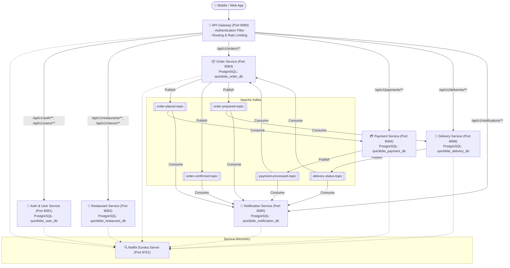

# 🍔 QuickBite - Food Ordering Microservices Platform

**QuickBite** is a scalable, cloud-native backend built with **Java 17, Spring Boot 3, Spring Cloud, Apache Kafka, and PostgreSQL**, following the microservices architecture pattern and event-driven choreography.

---

## 🏛️ System Architecture



---

## 📦 Services Breakdown

| Service | Port | Database | Description |
| :--- | :--- | :--- | :--- |
| **`discovery-service`** | `8761` | N/A | Netflix Eureka Service Registry |
| **`api-gateway`** | `8080` | N/A | Unified entry point, JWT validation filter, CORS, Load Balancer |
| **`auth-user-service`** | `8081` | `quickbite_user_db` | User registration, authentication, JWT tokens, addresses |
| **`restaurant-service`** | `8082` | `quickbite_restaurant_db`| Restaurants, Categories, and Menu Catalog |
| **`order-service`** | `8083` | `quickbite_order_db` | Orders management, pricing calculation, Feign client |
| **`payment-service`** | `8084` | `quickbite_payment_db` | Payment simulation, transaction ledger |
| **`delivery-service`** | `8086` | `quickbite_delivery_db` | Driver assignment, live tracking status updates |
| **`notification-service`**| `8085` | `quickbite_notification_db`| Multi-channel notifications logger & event listener |

---

## ⚡ Event-Driven Saga Flow (Choreography)

1. **Place Order**: User places an order via `order-service` (`POST /api/v1/orders`).
   - Order created with status `PENDING_PAYMENT`.
   - Emits `OrderPlacedEvent` on `order-placed-topic`.
2. **Process Payment**: `payment-service` consumes `OrderPlacedEvent` and executes transaction:
   - Emits `PaymentProcessedEvent` on `payment-processed-topic` (`COMPLETED` or `FAILED`).
3. **Confirm Order**: `order-service` updates status to `CONFIRMED` and emits `OrderConfirmedEvent`.
4. **Prepare Order**: Restaurant updates status to `READY_FOR_PICKUP` (`PATCH /api/v1/orders/{id}/status`).
   - Emits `OrderPreparedEvent` on `order-prepared-topic`.
5. **Assign Driver**: `delivery-service` receives `OrderPreparedEvent`, auto-assigns nearest driver, and emits `DeliveryStatusUpdatedEvent`.
6. **Live Notifications**: `notification-service` listens to all topics and dispatches alerts at each stage.

---

## 🚀 Quick Start with Docker Compose

To start the entire ecosystem (PostgreSQL, Kafka, Zookeeper, Eureka, Gateway, and all 6 microservices):

```bash
docker compose up --build
```

### Accessing Services:
- **API Gateway**: `http://localhost:8080`
- **Eureka Dashboard**: `http://localhost:8761`
- **Swagger Documentation** (per service):
  - Auth: `http://localhost:8081/swagger-ui.html`
  - Restaurant: `http://localhost:8082/swagger-ui.html`
  - Order: `http://localhost:8083/swagger-ui.html`
  - Payment: `http://localhost:8084/swagger-ui.html`
  - Delivery: `http://localhost:8086/swagger-ui.html`
  - Notification: `http://localhost:8085/swagger-ui.html`

---

## 🧪 End-to-End API Walkthrough

### 1. Register a User
```http
POST http://localhost:8080/api/v1/auth/register
Content-Type: application/json

{
  "email": "customer@quickbite.com",
  "password": "password123",
  "fullName": "John Doe",
  "phoneNumber": "+84 901 234 567",
  "role": "ROLE_CUSTOMER"
}
```

### 2. Login & Obtain JWT
```http
POST http://localhost:8080/api/v1/auth/login
Content-Type: application/json

{
  "email": "customer@quickbite.com",
  "password": "password123"
}
```
*Copy the `accessToken` from the response.*

---

### 3. Create a Restaurant (Owner / Admin)
```http
POST http://localhost:8080/api/v1/restaurants
Authorization: Bearer <ACCESS_TOKEN>
Content-Type: application/json

{
  "name": "Pho Hanoi Delights",
  "description": "Authentic Vietnamese beef noodle soup",
  "address": "123 Le Loi Street",
  "city": "Hanoi",
  "phoneNumber": "+84 243 888 999",
  "openingTime": "07:00:00",
  "closingTime": "22:00:00",
  "isOpen": true,
  "isFeatured": true
}
```

---

### 4. Add Menu Item
```http
POST http://localhost:8080/api/v1/menus
Authorization: Bearer <ACCESS_TOKEN>
Content-Type: application/json

{
  "restaurantId": 1,
  "name": "Special Beef Pho (Pho Bo Dac Biet)",
  "description": "Slow-cooked bone broth with sliced wagyu beef and fresh herbs",
  "price": 8.50,
  "available": true,
  "preparationTimeMinutes": 15
}
```

---

### 5. Place an Order (Customer)
```http
POST http://localhost:8080/api/v1/orders
Authorization: Bearer <ACCESS_TOKEN>
Content-Type: application/json

{
  "restaurantId": 1,
  "paymentMethod": "CREDIT_CARD",
  "deliveryAddress": "456 Kim Ma, Ba Dinh, Hanoi",
  "specialInstructions": "Extra lime and chili on the side please",
  "items": [
    {
      "menuItemId": 1,
      "quantity": 2
    }
  ]
}
```

---

### 6. Track Order & Delivery
```http
# Check Order Status
GET http://localhost:8080/api/v1/orders/1
Authorization: Bearer <ACCESS_TOKEN>

# Check Delivery Status
GET http://localhost:8080/api/v1/deliveries/order/1
Authorization: Bearer <ACCESS_TOKEN>

# Check Notifications
GET http://localhost:8080/api/v1/notifications/user/me
Authorization: Bearer <ACCESS_TOKEN>
```
