# BÁO CÁO THỰC HÀNH BÀI 4: TÍCH HỢP CI/CD TỰ ĐỘNG PULL IMAGE TỪ GHCR

**Dự án:** QuickBite Microservices Platform (`payment-service`)  
**Khóa học / Module:** MD5 - DevOps & Microservices  
**Branch thực hiện:** `Session8-HW4`  
**Học viên:** `ltvhcung001`  
**Workflow File:** `.github/workflows/ci.yml`  
**Target Image:** `ghcr.io/ltvhcung001/payment-service:1.0.0`  

---

## 1. MỤC TIÊU HỌC TẬP
- Khai thác biến môi trường mặc định của GitHub Actions (`secrets.GITHUB_TOKEN`) để đơn giản hóa bảo mật và loại bỏ việc quản lý Personal Access Token (PAT) thủ công.
- Cấu hình khối quyền hạn (`permissions`) cho workflow để truy xuất tài nguyên container trên GitHub Container Registry.
- Xử lý triệt để lỗi phân biệt chữ hoa/chữ thường (case sensitivity) trong quy chuẩn đặt tên namespace của Docker và GHCR.
- Đo lường và đánh giá hiệu năng vượt trội của mô hình kéo image đóng gói sẵn so với việc biên dịch lại mã nguồn từ đầu.

---

## 2. PHÂN TÍCH BỐI CẢNH VÀ NGUYÊN LÝ KỸ THUẬT

### 2.1. Lỗi chưa xác thực khi pull image trên CI (`unauthenticated`)
- **Tình huống:** Khi một GitHub Actions runner thực hiện lệnh `docker pull ghcr.io/<owner>/payment-service:1.0.0` từ một package được cấu hình ở chế độ Private hoặc Internal, hệ thống GHCR từ chối truy cập nếu phiên làm việc chưa được xác thực.
- **Giải pháp bảo mật tối ưu:** Thay vì phải tạo một PAT thủ công rồi lưu vào GitHub Repository Secrets (tiềm ẩn rủi ro lộ token và hết hạn định kỳ), GitHub Actions cung cấp sẵn token tự động sinh theo từng luồng chạy: `secrets.GITHUB_TOKEN`.
- **Cấu hình phân quyền `permissions`:** Theo mặc định bảo mật Least Privilege của GitHub, `GITHUB_TOKEN` có quyền hạn tối thiểu. Để cho phép token này đọc được các package từ GHCR, file YAML bắt buộc phải khai báo khối:
  ```yaml
  permissions:
    contents: read
    packages: read
  ```

### 2.2. Xử lý lỗi Namespace chữ hoa (Case Sensitivity)
- Theo chuẩn OCI (Open Container Initiative) và quy định của GitHub Container Registry, toàn bộ thành phần đường dẫn image (registry hostname, namespace, repository name) **bắt buộc phải là chữ thường (lowercase)**.
- Biến `${{ github.repository_owner }}` hoặc `${{ github.actor }}` có thể chứa ký tự viết hoa (ví dụ: `MyOrg`, `QuickBiteUser`).
- Nếu trực tiếp ghép chuỗi `ghcr.io/${{ github.repository_owner }}/...`, Docker CLI sẽ báo lỗi cú pháp hoặc từ chối kết nối.
- **Giải pháp:** Chuyển đổi tên sang chữ thường thông qua lệnh shell:
  ```bash
  OWNER=$(echo "${{ github.repository_owner }}" | tr '[:upper:]' '[:lower:]')
  ```

---

## 3. CẤU TRÚC FILE WORKFLOW HOÀN CHỈNH (`.github/workflows/ci.yml`)

```yaml
name: Payment Service CI - Pull Image from GHCR

on:
  push:
    branches:
      - main
      - master
      - Session8-HW4
  pull_request:
    branches:
      - main
      - master
      - Session8-HW4
  workflow_dispatch:

permissions:
  contents: read
  packages: read

jobs:
  pull_and_verify:
    name: Pull & Verify GHCR Image
    runs-on: ubuntu-latest
    steps:
      - name: Checkout repository
        uses: actions/checkout@v4

      - name: Log in to GitHub Container Registry (GHCR)
        uses: docker/login-action@v3
        with:
          registry: ghcr.io
          username: ${{ github.actor }}
          password: ${{ secrets.GITHUB_TOKEN }}

      - name: Pull Docker Image from GHCR
        run: |
          # 1. Khắc phục rủi ro tên owner/repo chứa chữ hoa bằng cách chuyển sang chữ thường
          OWNER=$(echo "${{ github.repository_owner }}" | tr '[:upper:]' '[:lower:]')
          IMAGE="ghcr.io/${OWNER}/payment-service:1.0.0"

          echo "=== Pulling image from GHCR: ${IMAGE} ==="
          docker pull "${IMAGE}"

      - name: Run Container in Detached Mode
        run: |
          OWNER=$(echo "${{ github.repository_owner }}" | tr '[:upper:]' '[:lower:]')
          IMAGE="ghcr.io/${OWNER}/payment-service:1.0.0"

          echo "=== Starting container in detached mode ==="
          docker run -d --name payment-service-verify -p 8084:8084 "${IMAGE}"

      - name: Verify Running Container
        run: |
          sleep 3
          echo "=== Checking container status ==="
          docker ps --filter "name=payment-service-verify"

          echo "=== Inspecting container logs ==="
          docker logs --tail 30 payment-service-verify

      - name: Stop and Cleanup Container
        if: always()
        run: |
          docker stop payment-service-verify || true
          docker rm payment-service-verify || true
```

---

## 4. SO SÁNH HIỆU NĂNG VÀ LỢI ÍCH KIẾN TRÚC

```mermaid
gantt
    title So sánh thời gian thực thi Pipeline (Giây)
    dateFormat X
    axisFormat %s s

    section Cách truyền thống (Biên dịch lại)
    Checkout & Setup JDK       : 0, 10
    Gradle / Maven Build Jar   : 10, 60
    Docker Build All Layers    : 60, 95

    section Cách tối ưu (Pull Pre-built Image)
    Login GHCR                 : 0, 2
    Docker Pull Pre-built Image: 2, 8
    Docker Run Detached & Curl : 8, 15
```



| Tiêu chí so sánh | Cách làm cũ (Biên dịch lại từ source) | Cách làm mới (Pull Image từ GHCR) |
| :--- | :--- | :--- |
| **Thời gian thực thi** | **1 phút 30 giây - 3 phút** | **~12 - 16 giây** (Dưới 20 giây) |
| **Tài nguyên tiêu tốn** | Tải hàng trăm MB thư viện, CPU 100% khi compile | Chỉ tải đúng các layer nén của image (~87MB) |
| **Môi trường phụ thuộc** | Bắt buộc cài JDK 17/21, Gradle, Maven, build cache | Chỉ cần Docker runtime duy nhất |
| **Tính bất biến (Immutability)** | Rủi ro thay đổi dependency ngầm giữa các lần build | **100% nhất quán**: Image chạy trên CI giống hệt Production |

---

## 5. HƯỚNG DẪN NỘP BÀI LÊN PORTAL

1. **File nộp trực tiếp:**
   * File [`.github/workflows/ci.yml`](file:///home/cungh/Documents/rikkei/md5/ss7/.github/workflows/ci.yml) hoàn chỉnh.
2. **Đường dẫn (URL) kết quả chạy thành công:**
   * Sau khi push branch `Session8-HW4` lên GitHub, truy cập tab **Actions** tại:
     `https://github.com/ltvhcung001/session7-md5/actions`
   * Mở workflow run mới nhất của branch `Session8-HW4` (có tích xanh `completed - success`).
   * Sao chép đường link URL của màn hình run đó (dạng `https://github.com/ltvhcung001/session7-md5/actions/runs/xxxxxxxx`) để nộp lên Portal LMS.
