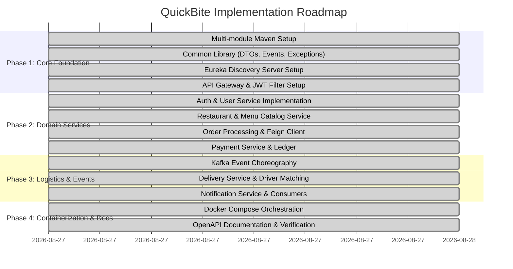

# QuickBite Technical Implementation Plan

**Plan Version:** 1.0.0  
**Status:** In Progress / Baseline Executed  
**Date:** 2026-08-27  

---

## 1. Architectural Milestones & Phases

---

## 2. Microservice Dependency Matrix

| Service | Upstream Dependencies (Sync / Feign) | Event Subscriptions (Kafka) | Event Publications (Kafka) |
| :--- | :--- | :--- | :--- |
| **`discovery-service`** | None | None | None |
| **`api-gateway`** | Discovery (`discovery-service`) | None | None |
| **`auth-user-service`** | Discovery | None | None |
| **`restaurant-service`**| Discovery | None | None |
| **`order-service`** | `restaurant-service`, `auth-user-service` | `payment-processed-topic`, `delivery-status-topic` | `order-placed-topic`, `order-confirmed-topic`, `order-prepared-topic` |
| **`payment-service`** | Discovery | `order-placed-topic` | `payment-processed-topic` |
| **`delivery-service`** | Discovery | `order-prepared-topic` | `delivery-status-topic` |
| **`notification-service`**| Discovery | `order-placed-topic`, `payment-processed-topic`, `order-confirmed-topic`, `delivery-status-topic` | None |

---

## 3. Database Initialization Strategy

- **Database-per-service pattern** is implemented on PostgreSQL 16.
- A centralized SQL script `docker/postgres/init-databases.sql` automatically provisions separate catalogs on container startup:
  1. `quickbite_user_db`
  2. `quickbite_restaurant_db`
  3. `quickbite_order_db`
  4. `quickbite_payment_db`
  5. `quickbite_delivery_db`
  6. `quickbite_notification_db`
- Hibernate `ddl-auto: update` manages schema evolution per microservice seamlessly in development.

---

## 4. Container Orchestration & Networking

- **Network:** `quickbite-network` (bridge network enabling DNS-based service discovery).
- **Service Dependency Ordering:**
  - `postgres` (healthcheck ensures database readiness before services start).
  - `zookeeper` -> `kafka`.
  - `discovery-service` starts before all dependent business microservices.
  - `api-gateway` binds to port 8080 as the external frontend proxy.

---

## 5. Verification and Quality Assurance Plan

1. **Compilation Validation:** Run `mvn clean test-compile` across the entire multi-module reactor.
2. **Container Build Validation:** Build Docker images for each service using multi-stage builds.
3. **End-to-End Test Suite:**
   - User Registration & JWT Token generation.
   - Restaurant creation & Menu item cataloging.
   - Order placement with Feign pricing validation.
   - Kafka event trigger from `order-service` -> `payment-service` -> `order-service` state progression.
   - Order preparation -> `delivery-service` driver assignment.
   - Verification of `notification-service` inbox logs.
