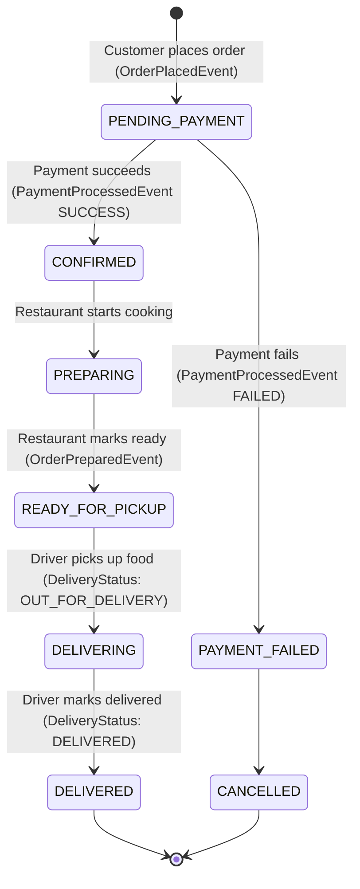

# QuickBite Platform - Functional & Technical Specification

**Specification Version:** 1.0.0  
**Status:** Approved / Implemented  
**Date:** 2026-08-27  

---

## 1. Executive Summary

**QuickBite** is a modern, distributed, on-demand food delivery platform that connects customers, restaurant partners, and delivery couriers. The system is designed following the **Microservices Architecture** pattern on Java 17 / Spring Boot 3, using **Apache Kafka** for asynchronous choreography and **Spring Cloud Gateway** with **Netflix Eureka** for routing and discovery.

---

## 2. Actors & User Personas

| Actor | Description | Key Actions |
| :--- | :--- | :--- |
| **Customer** | End consumer ordering meals | Registers, manages delivery addresses, browses menus, places orders, makes payments, tracks deliveries in real-time. |
| **Restaurant Owner** | Vendor managing dining establishments | Registers restaurant profile, manages menu items & categories, sets pricing, marks items available/sold out, marks orders as prepared. |
| **Driver / Courier** | Logistics partner delivering orders | Receives automated delivery assignments, accepts orders, updates live GPS coordinates and delivery status (`PICKED_UP`, `OUT_FOR_DELIVERY`, `DELIVERED`). |
| **Platform Administrator** | Governance and operational supervisor | Monitors service metrics, manages users, handles disputed orders. |

---

## 3. Microservice Ecosystem Architecture

```
                                    +-----------------------+
                                    |     Client Apps       |
                                    | (Web / Mobile / Post) |
                                    +-----------+-----------+
                                                |
                                                v
                                    +-----------------------+
                                    |  Spring Cloud Gateway |
                                    |      (Port: 8080)     |
                                    +-----------+-----------+
                                                |
     +------------------------------------------+------------------------------------------+
     |                    |                     |                    |                     |
     v                    v                     v                    v                     v
+----------+       +--------------+      +--------------+     +--------------+      +--------------+
| Auth/User|       |  Restaurant  |      |    Order     |     |   Payment    |      |   Delivery   |
| Service  |       |   Service    |      |   Service    |     |   Service    |      |   Service    |
| (:8081)  |       |   (:8082)    |      |   (:8083)    |     |   (:8084)    |      |   (:8086)    |
+----+-----+       +------+-------+      +------+-------+     +------+-------+      +------+-------+
     |                    |                     |                    |                     |
     |                    |                     |  Feign Query       |                     |
     |                    +<--------------------+--------------------+                     |
     |                                          |                                          |
+----+------------------------------------------+------------------------------------------+----+
|                                    Apache Kafka Event Broker                                 |
|  [order-placed-topic]  [payment-processed-topic]  [order-confirmed-topic]  [delivery-topic]  |
+-----------------------------------------------+-----------------------------------------------+
                                                |
                                                v
                                     +--------------------+
                                     |Notification Service|
                                     |      (:8085)       |
                                     +--------------------+
```

---

## 4. Functional Requirements by Microservice

### 4.1 Discovery Service (`discovery-service`)
- **Port:** 8761
- **Technology:** Spring Cloud Netflix Eureka Server.
- **Responsibilities:** Centralized service registry allowing all microservices to discover each other dynamically without hardcoded hostnames/ports.

### 4.2 API Gateway (`api-gateway`)
- **Port:** 8080
- **Technology:** Spring Cloud Gateway, Reactive Netty.
- **Responsibilities:**
  - Reverse proxy and unified routing to downstream microservices using `lb://<service-name>`.
  - Global CORS filter configuration.
  - JWT Authentication filter (`AuthenticationFilter`): extracts `Authorization: Bearer <token>`, validates signature, extracts claims, and injects `X-User-Id`, `X-User-Email`, `X-User-Role` headers downstream.
  - Whitelist public endpoints (`/api/v1/auth/**`, `/v3/api-docs/**`, `/swagger-ui/**`, etc.).

### 4.3 Auth & User Service (`auth-user-service`)
- **Port:** 8081 | **Database:** `quickbite_user_db` (PostgreSQL)
- **Domain Entities:** `User`, `Address`.
- **Capabilities:**
  - `POST /api/v1/auth/register`: User registration with BCrypt encrypted passwords and role assignment.
  - `POST /api/v1/auth/login`: Authentication returning JWT access and refresh tokens.
  - `POST /api/v1/auth/refresh`: Generates fresh access tokens from valid refresh tokens.
  - `GET /api/v1/users/me`: Current user profile details.
  - `PUT /api/v1/users/me`: Profile updates (name, phone).
  - `POST /api/v1/users/me/addresses`: Address book management with default address toggle.
  - `GET /api/v1/users/{id}/summary`: Inter-service endpoint for fast user summary lookup.

### 4.4 Restaurant Service (`restaurant-service`)
- **Port:** 8082 | **Database:** `quickbite_restaurant_db` (PostgreSQL)
- **Domain Entities:** `Restaurant`, `Category`, `MenuItem`.
- **Capabilities:**
  - `POST /api/v1/restaurants`: Restaurant creation by owners.
  - `GET /api/v1/restaurants`: Fetch all open restaurants.
  - `GET /api/v1/restaurants/{id}`: Detailed restaurant view with categories and full menu.
  - `GET /api/v1/restaurants/search?query=...`: Keyword search across names and descriptions.
  - `POST /api/v1/restaurants/{id}/categories`: Add menu categories (e.g., Appetizers, Main Course, Drinks).
  - `POST /api/v1/menus`: Create new menu item with price and preparation time.
  - `GET /api/v1/menus/{id}/summary`: Inter-service lightweight endpoint for order price validation.

### 4.5 Order Service (`order-service`)
- **Port:** 8083 | **Database:** `quickbite_order_db` (PostgreSQL)
- **Domain Entities:** `Order`, `OrderItem`.
- **Capabilities:**
  - `POST /api/v1/orders`: Validates restaurant and live item prices via OpenFeign (`RestaurantClient`), creates order in `PENDING_PAYMENT` state, and publishes `OrderPlacedEvent` to Kafka.
  - `GET /api/v1/orders/{id}`: Full order tracking details.
  - `GET /api/v1/orders/customer/me`: Customer order history.
  - `GET /api/v1/orders/restaurant/{restaurantId}`: Active orders for restaurant kitchen.
  - `PATCH /api/v1/orders/{id}/status`: State updates (`PREPARING`, `READY_FOR_PICKUP`). Emits `OrderPreparedEvent` when ready for driver pickup.
  - **Kafka Listeners:** Listens to `payment-processed-topic` to advance order to `CONFIRMED` or `PAYMENT_FAILED`; listens to `delivery-status-topic` to update order to `DELIVERING` / `DELIVERED`.

### 4.6 Payment Service (`payment-service`)
- **Port:** 8084 | **Database:** `quickbite_payment_db` (PostgreSQL)
- **Domain Entities:** `Payment`.
- **Capabilities:**
  - `POST /api/v1/payments/process`: Explicit payment settlement endpoint.
  - `GET /api/v1/payments/order/{orderId}`: Query payment transaction by order ID.
  - **Kafka Consumer:** Listens to `order-placed-topic`, executes payment transaction simulation, records ledger entry, and publishes `PaymentProcessedEvent` on `payment-processed-topic`.

### 4.7 Delivery Service (`delivery-service`)
- **Port:** 8086 | **Database:** `quickbite_delivery_db` (PostgreSQL)
- **Domain Entities:** `Delivery`.
- **Capabilities:**
  - `GET /api/v1/deliveries/order/{orderId}`: Get current delivery details, driver info, and GPS coordinates.
  - `PATCH /api/v1/deliveries/{id}/status`: Driver updates delivery status (`PICKED_UP`, `OUT_FOR_DELIVERY`, `DELIVERED`) and telemetry.
  - **Kafka Consumer:** Listens to `order-prepared-topic` -> auto-assigns simulated nearby driver -> publishes `DeliveryStatusUpdatedEvent` on `delivery-status-topic`.

### 4.8 Notification Service (`notification-service`)
- **Port:** 8085 | **Database:** `quickbite_notification_db` (PostgreSQL)
- **Domain Entities:** `Notification`.
- **Capabilities:**
  - `GET /api/v1/notifications/user/me`: Notification inbox for logged-in user.
  - **Kafka Consumer:** Listens to all domain topics (`order-placed-topic`, `payment-processed-topic`, `order-confirmed-topic`, `delivery-status-topic`) and writes multi-channel alerts (SMS, Email, Push).

---

## 5. Distributed State Machine & Saga Flow



---

## 6. Non-Functional Requirements (NFRs)

1. **Performance & Latency:** Gateway routing overhead < 15ms. API p95 response time < 200ms.
2. **Scalability:** Horizontal scaling of microservices with Eureka round-robin load balancing.
3. **Fault Tolerance:** Resilient inter-service queries with timeout and fallback defaults.
4. **Data Isolation:** Complete database-per-service isolation in PostgreSQL.
5. **Observability:** Spring Boot Actuator health and metrics endpoints enabled on all services.
